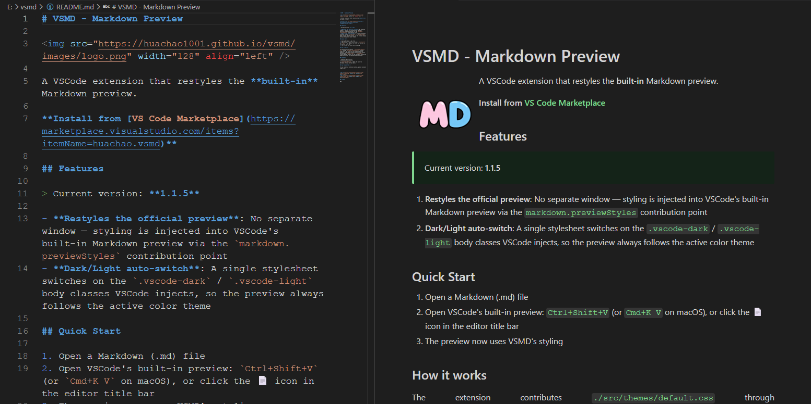

# VSMD - Markdown Preview

A VSCode extension that restyles the **built-in** Markdown preview.

**Install from [VS Code Marketplace](https://marketplace.visualstudio.com/items?itemName=huachao.vsmd)**

## Features

> Current version: **1.1.6**

- **Restyles the official preview**: No separate window — uses VSCode's built-in Markdown preview
- **Dark/Light auto-switch**: Preview styling automatically follows the active VSCode color theme

## Quick Start

1. Open a Markdown (.md) file
2. Open VSCode's built-in preview: `Ctrl+Shift+V` (or `Cmd+K V` on macOS), or click the 📄 icon in the editor title bar
3. The preview now uses VSMD's styling

## Commands

| Command | Description |
|---------|-------------|
| `vsmd.togglePreview` | Open the built-in Markdown preview to the side |

## Buy Me a Coffee ☕

If you find this extension useful, please consider supporting:

## License

MIT
